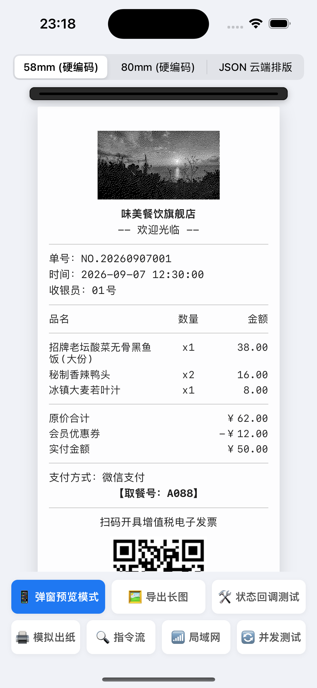
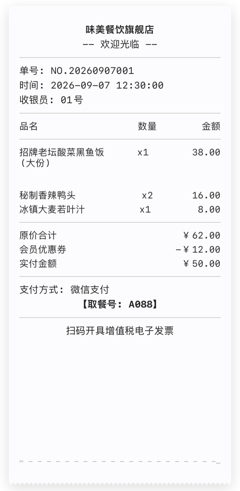
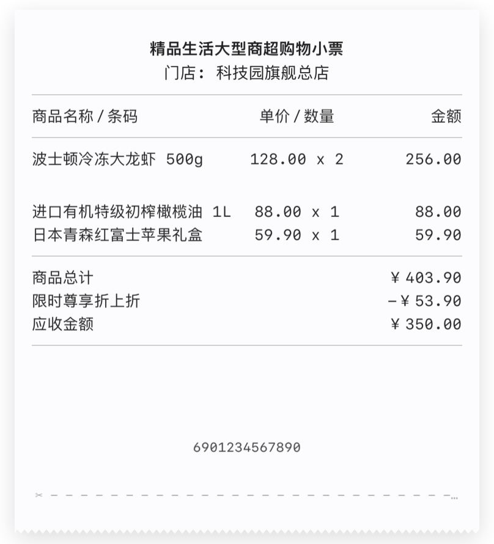

# LinePrinter

<p align="right">
  <a href="README_CN.md"><b>简体中文</b></a> | <b>English</b>
</p>

[](https://swift.org)
[](https://developer.apple.com/ios/)
[](https://swift.org/package-manager/)
[](https://cocoapods.org)
[](https://github.com/Nelozx/LinePrinter/blob/main/LICENSE)

`LinePrinter` is a pure native, zero-dependency, and non-intrusive **declarative ESC/POS thermal receipt layout engine and visual previewer** designed for iOS. Tailored for restaurant dining, takeout tickets, retail checkout, supermarkets, and warehouse logistics.

The core mission of `LinePrinter` is **declarative receipt layout, binary ESC/POS command stream (`Data`) generation, and realistic UI simulation**. It does not enforce Bluetooth or network connection management, completely avoiding conflicts with your app's existing `CBCentralManager`, network connection pools, or commercial POS hardware SDKs (e.g., Sunmi, Landi, Newland). **No sensitive Bluetooth or local network permissions are required in `Info.plist`**.

---

## 📸 Visual Showcase (Screenshots)

<p align="center">
  
  
  
</p>

| **📱 Physical Feed & Interactive Simulation** | **🧾 58mm Restaurant Multi-Column Wrapping** | **🏬 80mm Supermarket Wide Receipt** |
| :---: | :---: | :---: |
| Realistic paper feed translation & haptic feedback | Smart weight distribution & long item name wrapping | 48-char wide layout & Code128 barcode rendering |

---

## ✨ Key Features

- 🎯 **Decoupled Layout Engine & Transport**:
  - Compiles directly into standard ESC/POS binary data (`ticket.bytes(using: .gbk) -> Data`);
  - Provides a lightweight channel protocol `PrinterTransport` (`ticket.print(to: transport)`), making any external communication interface plug-and-play.
- 🛡️ **Zero Dependencies & Zero Permissions**: Built strictly on top of `UIKit` and standard system libraries. No 3rd-party dependencies, no permission declarations needed.
- 👁️ **High-Fidelity Visual Previewer (`TicketPreview`)**:
  - Realistic thermal paper aesthetics: chamfered top cut, serrated bottom tear-off edge, and soft shadows;
  - Generate a live interactive preview (`ticket.previewView()`) or export a high-res Retina (2x) long image (`ticket.previewImage()`) in a single line of code.
- 📊 **Smart Multi-Column Alignment & Auto-Wrapping**: Accurately computes display widths for full-width CJK characters and half-width ASCII; features **intelligent text wrapping (`wrap: true`)** while preserving price and quantity vertical alignment.
- 🖼️ **Industrial Bitmap Algorithms**: Native extension for `UIImage.rasterEscPosData` with both **Luminance Threshold** and **Floyd-Steinberg Error Diffusion Dithering**, delivering sharp logos and smooth gradient photos on 1-bit thermal paper.
- 🇨🇳 **Chinese Encoding Support**: Deeply optimized for GB18030 / GBK encoding to prevent garbled text.
- 🔍 **Hardware Status Parser**: Built-in `PrinterHardwareStatus.parse(byte:)` to instantly parse real-time error flags like **Out of Paper**, **Cover Open**, or **Offline**.
- 📱 **Declarative Swift DSL**: SwiftUI-like structure, clean and expressive.

---

## 📦 Installation

### Swift Package Manager (Recommended)

In Xcode, navigate to `File` -> `Add Packages...` and enter the repository URL:

```
https://github.com/Nelozx/LinePrinter.git
```

### CocoaPods

Add the following to your `Podfile`:

```ruby
# Option A: Specify the tagged release version (Recommended)
pod 'LinePrinter', :git => 'https://github.com/Nelozx/LinePrinter.git', :tag => '0.6.0'

# Option B: Track the latest main branch
pod 'LinePrinter', :git => 'https://github.com/Nelozx/LinePrinter.git'
```

---

## 🚀 Core Layout & Output Paradigms

LinePrinter values extreme simplicity and performance, retaining exclusively **2 clean layout paradigms**:

### Paradigm 1: Variadic Chaining Output (Build & Send Instantly)

No boilerplate array wrappers, elements separated cleanly by commas, directly chained into your transport pipeline:

```swift
import LinePrinter

// 1. Variadic Chaining Direct Dispatch (Build & send directly to Bluetooth / Network / POS)
LinePrinter.ticket(
    .image(base64: "data:image/png;base64,iVBORw0KGgo..."), // In-memory Base64 or local Image/Data
    .text("Quick Checkout Receipt", bold: true, alignment: .center),
    .splitter,
    .row(totalWidth: 32,
         Col("Item", weight: 2, alignment: .left),
         Col("Qty", weight: 1, alignment: .center),
         Col("Price", weight: 1, alignment: .right)),
    .splitter("-"),
    .row("Signature Sauerkraut Fish", "x1", "38.00", wrap: true),
    .row("Iced Barley Grass Juice", "x2", "16.00", wrap: true),
    .splitter,
    .row("Total Paid", "$54.00"),
    .qrcode("https://weixin.qq.com/r/example_invoice"),
    .cut
).print(to: bluetoothTransport)

// 2. Or retrieve raw ESC/POS continuous binary stream Data
let data = LinePrinter.ticket(
    .text("Order: NO.20260907001"),
    .row("Total Paid", "$20.00"),
    .cut
).bytes(using: .gbk)

// Freely transmit via your CoreBluetooth peripheral or TCP Socket:
myPeripheral.writeValue(data, for: myCharacteristic, type: .withoutResponse)
```

---

### Paradigm 2: Server-Driven Dynamic JSON Layout (Full Element Coverage / OTA)

Allow your cloud backend or microservices to dynamically push JSON templates covering **all text styles, arbitrary multi-columns, dynamic Base64 images, barcodes/QRCodes, and all hardware commands**:

```swift
// 1. Construct Ticket from server JSON string (Full element coverage)
let jsonString = """
{
  "autoInitialize": true,
  "autoCut": true,
  "chunks": [
    // Text (Bold, double size, underline, reverse)
    { "type": "text", "content": "Large Centered Title", "bold": true, "alignment": "center", "size": "double" },
    { "type": "text", "content": "White on Black Text", "alignment": "right", "reverse": true },
    // Splitter line
    { "type": "splitter", "char": "-", "printDensity": 384 },
    // Multi-column alignment with custom weights and smart wrapping
    {
      "type": "row",
      "totalWidth": 32,
      "columns": [
        { "text": "Grilled Salmon Special", "weight": 2, "wrap": true },
        { "text": "x1", "weight": 1, "alignment": "center" },
        { "text": "$38.00", "weight": 1, "alignment": "right" }
      ]
    },
    // Convenient two-column shortcut
    { "type": "twoColumn", "left": "Total Paid", "right": "$38.00" },
    // Native dot-matrix QRCode and 1D Barcode (with height & HRI)
    { "type": "qrcode", "content": "https://lineprinter.dev" },
    { "type": "barcode", "content": "20260908001", "barcodeType": "code128", "height": 60, "hri": "below" },
    // Image (In-memory Base64 or local asset name; with Floyd-Steinberg or threshold dithering)
    { "type": "image", "base64": "iVBORw0KGgo...", "dither": "threshold", "threshold": 128 },
    // Blank spacer
    { "type": "blank" },
    // Hardware control commands
    { "type": "spacing", "points": 24 },
    { "type": "beep", "times": 2, "duration": 3 },
    { "type": "drawer" },
    { "type": "feed", "lines": 2 },
    { "type": "cut" }
  ]
}
"""

let ticket = try Ticket(json: jsonString)

// 2. Dispatch with one line
ticket.print(to: bluetoothTransport)
```

---

### 3. Decoupled Transport Protocol `PrinterTransport`

Simply conform your Bluetooth manager, TCP Socket, or hardware service to `PrinterTransport`:

```swift
class MyBluetoothTransport: PrinterTransport {
    func write(_ data: Data) {
        // Handle MTU chunking or characteristic write
        peripheral.writeValue(data, for: characteristic, type: .withoutResponse)
    }
}
```

---

### 3. Visual UI Preview & High-Res Image Export

Inspect physical paper aesthetics and layout on screen without connecting to a hardware printer:

```swift
// 1. Obtain live preview UIView and insert into UI hierarchy
let previewView = ticket.previewView(paperWidth: .mm58)
myContainerView.addSubview(previewView)

// 2. Export as high-resolution Retina UIImage (Save to Photos or share)
if let receiptImage = ticket.previewImage(paperWidth: .mm58) {
    UIImageWriteToSavedPhotosAlbum(receiptImage, nil, nil, nil)
}
```

---

### 4. Real-time Hardware Status Parsing (Optional)

Whether notified via Bluetooth characteristic notification or received from a TCP socket response:

```swift
let status = PrinterHardwareStatus.parse(byte: receivedByte)

if status.contains(.paperEmpty) {
    print("⚠️ Printer is out of paper!")
}
if status.contains(.coverOpen) {
    print("⚠️ Platen cover is open!")
}
if status.contains(.offline) {
    print("⚠️ Printer is offline!")
}
```

---

## 🎨 DSL Elements Quick Reference

| DSL Element | Description |
|---|---|
| `.text("Content", bold: true, alignment: .center)` | Styled text with auto-reset alignment, size, and weight |
| `.splitter("-")` | Responsive full-width horizontal separator line |
| `.row("Item", "$10")` | Quick two-column aligned layout |
| `.row("Name", "Qty", "Price", wrap: true)` | Three-column layout with optional auto-wrapping for long names |
| `.row(totalWidth: 32, Col("Name", weight: 2), ...)` | Fully customizable multi-column layout with fixed widths or weights |
| `.image(uiImage, dither: .floydSteinberg)` | Raster bitmap with thresholding or Floyd-Steinberg error diffusion |
| `.qrcode("https://...")` | ESC/POS native hardware QR code |
| `.barcode("123456", type: .code128)` | Standard 1D barcode (with HRI text) |
| `.drawer` | Sends cash drawer pulse |
| `.cut` / `.partialCut` / `.feedAndCut` | Full cut / Partial cut / Feed & Cut |
| `.feed(3)` | Feed paper by specified number of lines |
| `.beep(2)` | Hardware buzzer / alert beeper |
| `.spacing(22)` / `.defaultSpacing` | Set custom line spacing / restore default |
| `.blackMark` | Feed paper to black mark / label seam |

---

## 📄 License & Contributing

- License: [MIT License](LICENSE)
- Changelog: [CHANGELOG.md](CHANGELOG.md)
- Contributing: [CONTRIBUTING.md](CONTRIBUTING.md)
